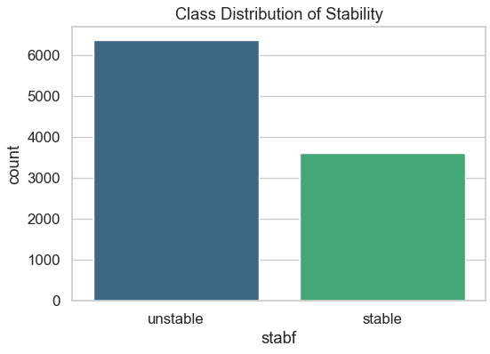
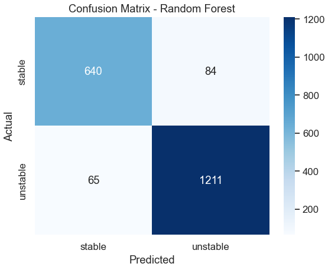
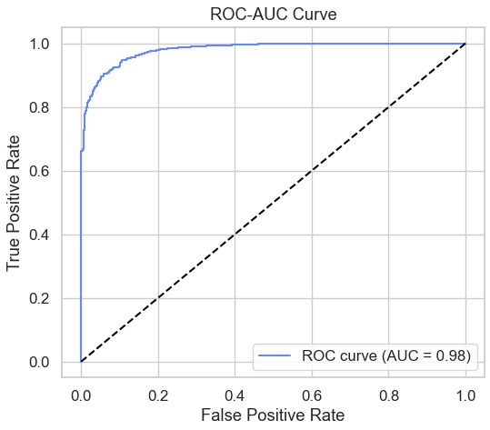

# ⚡ Grid Stability Prediction using Machine Learning

This project focuses on predicting **power grid stability** based on sensor-like simulation data of producers and consumers in an electrical grid.  
The goal is to anticipate **unstable states** before they occur — enabling early maintenance and preventing power failures.

---

## 🧠 Problem Statement

In modern energy grids, maintaining stability between **producers** (power plants) and **consumers** (loads) is critical.  
Even small fluctuations in parameters like **reaction time**, **nominal power**, or **price elasticity** can cause instability.

This project applies **machine learning** to predict whether the grid is in a *stable* or *unstable* state — enabling proactive rerouting or maintenance before customer impact.

---

## 📊 Dataset Overview

- **Rows:** 10,000 samples  
- **Columns:** 14  
- **Target Variable:** `stabf` → "stable" or "unstable"  
- **Features include:**
  - `tau[x]` → reaction times of participants (producers & consumers)
  - `p[x]` → nominal power produced (+) or consumed (-)
  - `g[x]` → elasticity coefficients
  - Derived features:
    - `avg_tau_consumers`
    - `avg_g_consumers`
    - `producer_to_consumer_ratio`
    - `total_power_consumed`

---

## 🔍 Exploratory Data Analysis (EDA)

- Data was **70% unstable** and **30% stable**
- No missing values
- Correlation analysis revealed strong relationships between `p` and `tau` values
- Added **engineered features** to capture grid dynamics better

### Data Distribution:

---

## 🧩 Model Development

### Machine Learning Algorithms Used:
- ✅ Logistic Regression
- ✅ Random Forest Classifier *(Best performing)*

### Performance Metrics (Random Forest):
| Metric | Score |
|---------|-------|
| Accuracy | **0.93** |
| Precision | 0.91 |
| Recall | 0.95 |
| F1-Score | 0.93 |
| ROC-AUC | 0.96 |

### Confusion Matrix:

The model correctly identifies **95% of unstable conditions**, making it reliable for early fault prediction.

---

## ⚙️ Model Optimization

- Applied **GridSearchCV** for hyperparameter tuning  
- Tuned parameters:
  - `n_estimators`
  - `max_depth`
  - `min_samples_split`
  - `min_samples_leaf`
- Final model saved as `grid_stability_model.pkl`

---

## 🚀 Deployment (Next Phase)

You can deploy this model in a:
- **Streamlit dashboard** → Upload CSV → Predict → Visualize stability  
- **Backend pipeline** → Integrate with real-time sensor data  
- **PDF report generator** → Auto-generate stability summaries

---

## 📈 Visualizations

- Correlation heatmap
- Feature importance plot
- ROC-AUC curve
- Precision-Recall curve
  
### ROC-AUC Curve:

---

## 💡 Key Insights

- **Reaction time (τ)** and **nominal power (p)** have the highest impact on stability.
- **Producers’ performance** is strongly correlated with system balance.
- Predicting instability early can help avoid downtime and costly outages.

---

## 🧰 Tech Stack

| Category | Tools |
|-----------|-------|
| Language | Python |
| Data Handling | Pandas, NumPy |
| Visualization | Matplotlib, Seaborn |
| ML Models | scikit-learn |
| Deployment | Streamlit (planned) |
| Model Explainability | SHAP |

---

## 🔮 Future Improvements

- Integrate live streaming data (IoT/sensor simulation)
- Add anomaly detection layer
- Deploy via API or web app for continuous monitoring

---

## 👨‍💻 Author

**Bhushan Yashwant Patil**  
📧  Email: patilbhushan1086@gmail.com
💼  LinkedIn Profile: https://www.linkedin.com/in/bhushan-patil-381601293/
📂  GitHub Portfolio: https://github.com/BhushanYP/Grids_Stability_ML_Model/

---

## 🏷️ Tags
`Machine Learning` `Data Science` `Grid Stability` `Energy Analytics` `Predictive Maintenance` `Random Forest` `Python`
